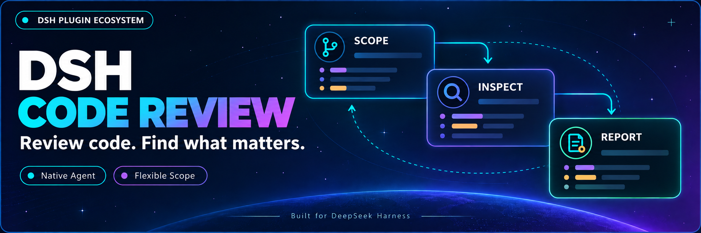

<p align="center">
  
</p>

<div align="center">

# DSH Code Review

**Start a review in your conversation. Let an independent agent inspect the code and bring back findings.**

[简体中文](README.zh-CN.md) · [Developer docs](docs/00-交接入口/00-阅读导航.md) · [Changelog](CHANGELOG.md) · [Apache-2.0](LICENSE)

[](LICENSE)
[](https://github.com/MichengAI/dsh-code-review)
[](https://github.com/deepseek-ai/deepseek-harness)
[](https://nodejs.org/)

</div>

DSH Code Review is a community code review plugin for DeepSeek Harness, packaged as `@michengai/dsh-code-review`. Enter `/review`, choose a scope or describe your request, and a native independent subagent inspects Git, source files, callers, and tests before returning a report to the main conversation. No Codex installation is required.

## Host compatibility

The current version targets **DSH `0.1.5-rc.2`** and loads through `dsh.bundle.patch`. It requires the native `spawn` provider, the `userQuestions` service, a question answerer for your platform, and a model that supports tool calls.

Install the package from npm or build from source. Offline host and package integration checks have passed; review quality, language adherence, and interaction across platforms still need live validation.

## What you can do

- **Choose a scope**: compare against a base branch, review uncommitted changes, select a commit, or provide custom instructions.
- **Let the reviewer gather evidence**: an independent context reads Git, relevant code, and tests without receiving a preloaded repository snapshot.
- **Read results in the main conversation**: receive prioritized findings with file paths and line numbers. Plain-text model responses are preserved.
- **Use English or Chinese reports**: a separate language context follows the host preference while preserving the original English Codex rubric.
- **Check status or cancel**: recover the latest report or cancel scope selection and an active review.

## Prerequisites

- A working DeepSeek Harness installation with `dsh` available in PowerShell.
- Node.js ≥ `22.19.0`, npm, and Git. Node.js must also meet your installed DSH version's requirements.
- Examples use the `web` profile; replace it with the profile running DSH.

## DSH product ecosystem

For a desktop workbench, download [DSH Codex Desktop](https://github.com/MichengAI/dsh-codex-desktop/releases). Existing [DeepSeek Harness](https://github.com/deepseek-ai/deepseek-harness) installations can add plugins as needed by following each project's README. Below are 11 first-party plugins; consult the corresponding desktop release notes and bundled catalog for what that version includes.

| Plugin | What you can do |
| --- | --- |
| [Codex UI](https://github.com/MichengAI/dsh-codex-ui) | Organize projects and conversations, search tasks, and navigate chat turns |
| [Agency Agents](https://github.com/MichengAI/dsh-agency-agents) | Choose and summon specialists for your task |
| [Skills Manager](https://github.com/MichengAI/dsh-skills-manager) | Find, enable, create, and import local skills |
| [Archive Manager](https://github.com/MichengAI/dsh-archive-manager) | Search, restore, or clean up archived conversations |
| [IM Connect](https://github.com/MichengAI/dsh-im-connect) | Send tasks and receive replies through messaging platforms |
| [Automation](https://github.com/MichengAI/dsh-automation) | Schedule tasks and review each run |
| [BTW](https://github.com/MichengAI/dsh-btw) | Ask side questions without interrupting the main task |
| [Simplify](https://github.com/MichengAI/dsh-simplify) | Use `/simplify` to improve code within your Git changes |
| [PUA](https://github.com/MichengAI/dsh-pua) | Guide the Agent to try new approaches after failures, investigate causes, and verify results before completion |
| [Code Review](https://github.com/MichengAI/dsh-code-review) | Use `/review` to request an independent Agent code review and receive the report in the current conversation |
| [Codex Pet](https://github.com/MichengAI/dsh-codex-pet) | View conversation notifications and respond to tool approvals and questions through a desktop pet |

## Installation

### Ask an agent to install it (recommended)

Send this prompt to an agent with local terminal access:

```text
Install the DSH plugin @michengai/dsh-code-review into my local web profile: run dsh plugin --profile web add @michengai/dsh-code-review@latest --registry=https://registry.npmjs.org/, then dsh --profile web --dump-config. Confirm the plugin is loaded and explain how to restart DSH and use /review. Stop and report the cause if any step fails.
```

### Install manually

Run these commands:

```powershell
[Console]::OutputEncoding = [System.Text.Encoding]::UTF8
$OutputEncoding = [System.Text.Encoding]::UTF8
dsh plugin --profile web add @michengai/dsh-code-review@latest --registry=https://registry.npmjs.org/
dsh --profile web --dump-config
```

Continue only after each step succeeds. Restart the DSH backend you actually use, then enter `/review`. This is a native plugin, not a `SKILL.md` bundle; do not copy `lib` manually.

## Usage

| Goal | Input |
| --- | --- |
| Open scope selection | `/review` |
| Set a custom focus | `/review Check the previous commit for authorization regressions` |
| View progress or the latest report | `/review-status` |
| Cancel selection or an active review | `/review-cancel` |

Empty input offers four options: base branch, uncommitted changes, a commit, and custom instructions. Uncommitted scope includes staged, unstaged, and untracked files. The base menu lists local branches; the commit menu lists the latest 100 commits. Other refs can be entered as free text.

All text after the command is treated as custom instructions, not CLI flags. `--base main`, `.`, and `status` are passed as ordinary text. The subagent determines and retrieves the context it needs. “Review the entire project” is passed verbatim, but does not mean the program has verified complete file-by-file coverage.

## Configuration and reports

| Optional setting | Behavior |
| --- | --- |
| `reviewModel` | Review model within the same provider; otherwise inherits the current model configuration |
| `reportDirectory` | Absolute report directory; defaults to `$DSH_HOME/code-review`, or `~/.dsh/code-review` when DSH_HOME is unset |

Language follows the host's `locale.preference`: `en` / `en-*` selects English; other values default to Chinese within the current two-language support. Each review captures the locale at its start; the next review reads updated settings. Command catalog descriptions and input hints are resolved when the plugin loads and require a reload to update. Without a saved preference or settings service, Chinese is used; the backend cannot read a language detected only in the browser.

The latest report is saved atomically per conversation. Historical report bodies are not translated. JSON keys, enum values, code, and paths remain unchanged. Unfinished reviews do not resume automatically after shutdown. Status, cancellation, and report storage are DSH plugin features.

## FAQ

### Is this identical to Codex?

The rubric and short task templates follow the fixed source commit `a592c38c16cdd7623dacc9168926ebccedfb67d3`. Questions, tools, permissions, and event presentation use native DSH capabilities. This is not a pixel-perfect Codex Desktop clone, and different models may produce different findings.

### Can a review change code?

The review instructions request no fixes, but the tool layer is not universally read-only. Execution depends on DSH permissions and its sandbox. The `never` approval policy rejects operations requiring approval. Corresponding web, image, and further-delegation tools are restricted; third-party aliases are outside the verified mapping.

### What if nothing appears after installation?

Check that installation and runtime use the same profile, restart the DSH backend, and confirm `dsh --profile web --dump-config` includes the plugin. Empty `/review` requires a host question answerer, and the main model must support the `code_review` tool. Use `/review-status` to inspect the record; a request acknowledgement is not review completion.

### Why might I still see another language?

Explicitly select Chinese or English in host settings. Model language is controlled by instructions and cannot be guaranteed. Raw external-tool errors, code, and historical reports are not automatically translated.

## Development and contributing

```powershell
[Console]::OutputEncoding = [System.Text.Encoding]::UTF8
$OutputEncoding = [System.Text.Encoding]::UTF8
npm ci --ignore-scripts
npm run check
npm run verify:package
dsh plugin --profile web add .\michengai-dsh-code-review-0.1.1.tgz --ignore-scripts
```

`check` covers TypeScript, prompt hashes, short tasks, real AgentLoop regression tests with offline models, and documentation links. `verify:package` checks bundle loading, peers, and installed-package host integration in an isolated profile. These checks do not replace live model validation.

| Entry | Responsibility |
| --- | --- |
| [src/index.ts](src/index.ts) | Commands, main-session tool, and report delivery |
| [src/selection.ts](src/selection.ts) | Native scope selection |
| [src/runtime.ts](src/runtime.ts) | Independent reviewer and tool restrictions |
| [src/request.ts](src/request.ts) | Codex short tasks and base-ref resolution |
| [src/i18n.ts](src/i18n.ts) | Host locale and output language context |
| [src/report.ts](src/report.ts) | Full JSON, extracted JSON, then plain-text fallback |

See the [developer navigation](docs/00-交接入口/00-阅读导航.md) for implementation history. To roll back, reinstall a previously retained local package and restart DSH. Conversations and reports are not deleted.

## Sources and license

Licensed under [Apache License 2.0](LICENSE). See the original Codex [rubric](assets/codex/review/rubric.md), [source.json](assets/codex/review/source.json), and [NOTICE](NOTICE).

Upstream source: [task templates](https://github.com/openai/codex/blob/a592c38c16cdd7623dacc9168926ebccedfb67d3/codex-rs/prompts/src/review_request.rs) · [review execution](https://github.com/openai/codex/blob/a592c38c16cdd7623dacc9168926ebccedfb67d3/codex-rs/core/src/tasks/review.rs) · [scope selection](https://github.com/openai/codex/blob/a592c38c16cdd7623dacc9168926ebccedfb67d3/codex-rs/tui/src/chatwidget/review_popups.rs) · [base branch resolution](https://github.com/openai/codex/blob/a592c38c16cdd7623dacc9168926ebccedfb67d3/codex-rs/git-utils/src/branch.rs).
