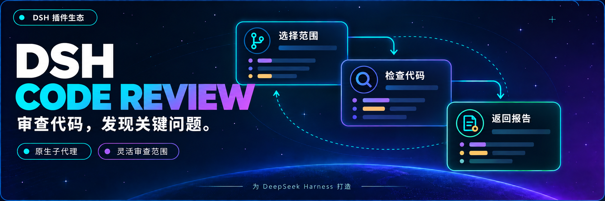

<p align="center">
  
</p>

<div align="center">

# DSH Code Review

**在当前会话发起审查，让独立 Agent 检查代码并带回报告**

[English](README.md) · [开发文档](docs/00-交接入口/00-阅读导航.md) · [Apache-2.0](LICENSE)

[](LICENSE)
[](https://github.com/MichengAI/dsh-code-review)
[](https://github.com/deepseek-ai/deepseek-harness)
[](https://nodejs.org/)

</div>

DSH Code Review 是 DeepSeek Harness 的社区代码审查插件，包名 `@michengai/dsh-code-review`。在当前会话输入 `/review`，选择范围或写下要求，原生独立子 Agent 会自行检查 Git、源码、调用方和测试，再把报告返回主会话。无需安装 Codex。

## 宿主兼容性

当前版本针对 **DSH `0.1.5-rc.2`** 开发与验证，通过 `dsh.bundle.patch` 加载。需要原生 `spawn` provider、`userQuestions` 服务、当前平台的问题回答器，以及支持工具调用的模型。

当前尚未发布 npm，请从源码构建安装。已验证离线宿主与安装包链路；真实模型的审查质量、语言遵循和不同平台的交互仍需实际验收。

## 你可以做什么

- **选择审查范围**：对比基准分支、检查未提交更改、选择一次提交，或输入自定义要求。
- **让审查 Agent 自行取证**：独立上下文读取 Git、相关代码和测试，不提前注入全仓代码快照。
- **在主会话查看结果**：接收带优先级、文件路径和行号的发现；模型返回普通文本时保留原文。
- **使用中英文报告**：通过独立语言上下文跟随宿主语言偏好，保留 Codex 英文规范原文。
- **查看状态或取消**：恢复最近一份报告，或取消范围选择和进行中的审查。

## 环境要求

- 已安装 DeepSeek Harness，PowerShell 中可运行 `dsh`。
- Node.js ≥ `22.19.0`、npm 和 Git；Node.js 同时应满足所安装 DSH 的要求。
- 示例使用 `web` profile，请替换为实际运行 DSH 的 profile。

## DSH 产品生态

[DSH Codex Desktop](https://github.com/MichengAI/dsh-codex-desktop/releases) 提供桌面工作台。已有 DSH 环境可按需搭配以下插件；Code Review 的安装以本文说明为准。

| 插件 | 用途 |
| --- | --- |
| [Codex UI](https://github.com/MichengAI/dsh-codex-ui) | 组织项目和会话，搜索任务与跳转对话 |
| [Agency Agents](https://github.com/MichengAI/dsh-agency-agents) | 选择和召唤不同领域的专家 |
| [Simplify](https://github.com/MichengAI/dsh-simplify) | 使用 `/simplify` 改进 Git 更改中的代码 |
| [BTW](https://github.com/MichengAI/dsh-btw) | 在不中断主任务的情况下提出旁支问题 |

## 安装

### 让 Agent 安装（推荐）

将以下要求发送给能访问本地终端的 Agent，并提供本仓库的实际路径：

```text
请从本地 dsh-code-review 仓库安装插件到 DSH 的 web profile：核对 Node.js 与 DSH 兼容性，在仓库中执行 npm ci --ignore-scripts、npm run check、npm pack，然后执行 dsh plugin --profile web add .\michengai-dsh-code-review-0.1.0.tgz --ignore-scripts。运行 dsh --profile web --dump-config，确认 @michengai/dsh-code-review 已加载，并说明如何重启 DSH 和使用 /review。任一步失败请停止并报告原因。
```

### 手动安装

在本仓库目录执行：

```powershell
[Console]::OutputEncoding = [System.Text.Encoding]::UTF8
$OutputEncoding = [System.Text.Encoding]::UTF8
npm ci --ignore-scripts
npm run check
npm pack
dsh plugin --profile web add .\michengai-dsh-code-review-0.1.0.tgz --ignore-scripts
dsh --profile web --dump-config
```

各步成功后再执行下一步。重启实际运行的 DSH 后端，再输入 `/review`。这是原生插件，无需手工复制 `lib`，也不是 `SKILL.md` 技能包。

## 使用

| 目标 | 输入 |
| --- | --- |
| 打开范围选择 | `/review` |
| 自定义审查重点 | `/review 检查上一提交的权限回归` |
| 查看进度或最近报告 | `/review-status` |
| 取消选择或正在运行的审查 | `/review-cancel` |

空输入提供四项：对比基准分支、审查未提交更改、审查某次提交、自定义要求。未提交范围包括暂存、未暂存和未跟踪文件。基准菜单列出本地分支；提交菜单列出最近 100 条提交，也可自由输入其他引用。

命令后面的整段文本都是自定义要求，不解析 CLI 参数。`--base main`、`.`、`status` 均按普通文字传递。审查范围和所需上下文由子 Agent 自行判断和获取；“审查全项目”会原样传递，但不代表程序已验证逐文件完整覆盖。

## 配置与报告

| 可选配置 | 行为 |
| --- | --- |
| `reviewModel` | 同一模型提供方下的审查模型名称；省略时继承当前模型配置 |
| `reportDirectory` | 报告存放的绝对路径；默认 `$DSH_HOME/code-review`，未设置 DSH_HOME 时为 `~/.dsh/code-review` |

语言复用宿主 `locale.preference`：`en` / `en-*` 使用英文，其余按当前中英文支持范围默认中文。每轮开始固定语言，下轮读取新设置；命令目录描述和输入提示在插件加载时确定，更新它们需重新加载插件。未保存偏好或没有 settings 服务时默认中文，后端无法获取仅由浏览器自动检测的语言。

每个会话原子保存最近一份报告。历史报告正文不自动翻译；JSON 字段、枚举、代码和路径保持原样。宿主退出后不会自动续跑未完成审查。状态、取消和报告存储是 DSH 插件提供的能力。

## 常见问题

### 与 Codex 完全一样吗？

审查规范和短任务模板对照固定源码提交 `a592c38c16cdd7623dacc9168926ebccedfb67d3`。问题界面、工具、权限和事件展示使用 DSH 原生能力，不是 Codex Desktop 的像素复刻；不同模型不保证相同发现。

### 审查会修改代码吗？

审查要求不生成修复，但工具层并非强制全部只读。执行能力取决于 DSH 权限与沙箱；`never` 审批表示需要审批的操作会被拒绝。已限制对应的网页、图片和继续委派工具，第三方别名不属于已核对范围。

### 安装后没有输出怎么办？

确认安装和运行使用同一 profile，重启 DSH 后端，再检查 `dsh --profile web --dump-config` 是否包含插件。空 `/review` 需要宿主问题回答器，主模型也必须支持 `code_review` 工具调用。可用 `/review-status` 查看记录；不要把“已提交请求”当成审查完成。

### 中文界面为什么仍可能看到英文？

请在宿主明确选择中文或英文。模型输出由语言指令约束，无法保证始终遵守；外部工具的原始错误、代码和历史报告不会自动翻译。

## 开发与贡献

```powershell
[Console]::OutputEncoding = [System.Text.Encoding]::UTF8
$OutputEncoding = [System.Text.Encoding]::UTF8
npm ci --ignore-scripts
npm run check
npm run verify:package
```

`check` 包含 TypeScript、提示词哈希、短任务与真实 AgentLoop 配合离线模型的回归，以及文档链接检查。`verify:package` 在隔离 profile 验证 bundle、peer 和安装包宿主链路。这些检查不替代在线模型验收。

| 入口 | 职责 |
| --- | --- |
| [src/index.ts](src/index.ts) | 命令、主会话工具与报告返回 |
| [src/selection.ts](src/selection.ts) | 原生范围选择 |
| [src/runtime.ts](src/runtime.ts) | 独立审查 Agent 与工具约束 |
| [src/request.ts](src/request.ts) | Codex 短任务和基准引用解析 |
| [src/i18n.ts](src/i18n.ts) | 宿主语言与输出语言上下文 |
| [src/report.ts](src/report.ts) | JSON、截取 JSON、纯文本顺序回退 |

完整交接记录见[阅读导航](docs/00-交接入口/00-阅读导航.md)。回退可重新安装先前保留的本地包并重启 DSH，不删除会话或报告。

## 来源与许可证

基于 [Apache License 2.0](LICENSE) 发布。Codex 原文与来源信息见 [rubric](assets/codex/review/rubric.md)、[source.json](assets/codex/review/source.json) 和 [NOTICE](NOTICE)。

上游源码：[任务模板](https://github.com/openai/codex/blob/a592c38c16cdd7623dacc9168926ebccedfb67d3/codex-rs/prompts/src/review_request.rs) · [审查执行](https://github.com/openai/codex/blob/a592c38c16cdd7623dacc9168926ebccedfb67d3/codex-rs/core/src/tasks/review.rs) · [范围选择](https://github.com/openai/codex/blob/a592c38c16cdd7623dacc9168926ebccedfb67d3/codex-rs/tui/src/chatwidget/review_popups.rs) · [基准分支解析](https://github.com/openai/codex/blob/a592c38c16cdd7623dacc9168926ebccedfb67d3/codex-rs/git-utils/src/branch.rs)。
